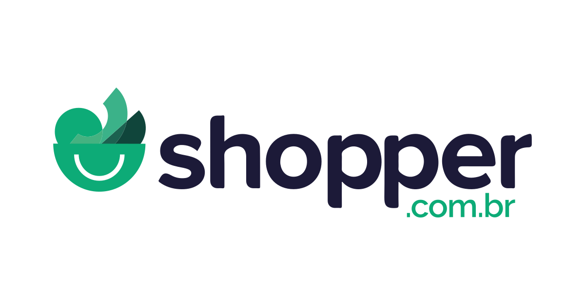

<p align="center">
   
</p>

<p align="center">	
   <a href="https://www.linkedin.com/in/gustavo-gk/">
      
   </a>
  
  
  <a href="mailto:seu-email@gmail.com">
   
  </a>
</p>

<p align="center">
  👏  Projeto desenvolvido como parte de um teste técnico envolvendo a criação de uma API RESTful com Node.js e Express.
</p>

<div align="center">
  <sub> Feito com 💖 por
    <a href="https://github.com/gustavogk"> Gustavo Assunção.
    <h1></h1>
  </sub>
</div>
  
# 📌 Conteúdo

* [Sobre o Projeto](#sobre-o-projeto)
* [Tecnologias](#rocket-tecnologias)  
* [Como Executar o Projeto](#como-executar-o-projeto)
* [Estrutura das Rotas](#estrutura-das-rotas)
* [Licença](#page_facing_up-licença)
  
# Sobre o Projeto

Este projeto consiste em uma API RESTful para manipular medições de clientes. A API permite o upload de imagens de medições, a confirmação de medições, e a listagem das medições realizadas, filtradas por tipo (WATER ou GAS). 

# :rocket: Tecnologias
Este projeto foi desenvolvido utilizando as seguintes tecnologias:

* [Node.js](https://nodejs.org/en/)
* [Express](https://expressjs.com/)
* [Sequelize](https://sequelize.org/)
* [PostgreSQL](https://www.postgresql.org/)
* [Typescript](https://www.typescriptlang.org/)

# Como Executar o Projeto

Para executar o projeto, siga as etapas abaixo:

1. Clone o repositório:
   ```bash
   git clone https://github.com/gustavogk/shopper-tecnical-test.git
   docker-compose build
   docker-compose up

# :page_facing_up: License

This project is under the [MIT license](./LICENSE).
Made with 💖 by [Gustavo Assunção](https://www.linkedin.com/in/gustavo-gk/). 

Thank you! 🌠


